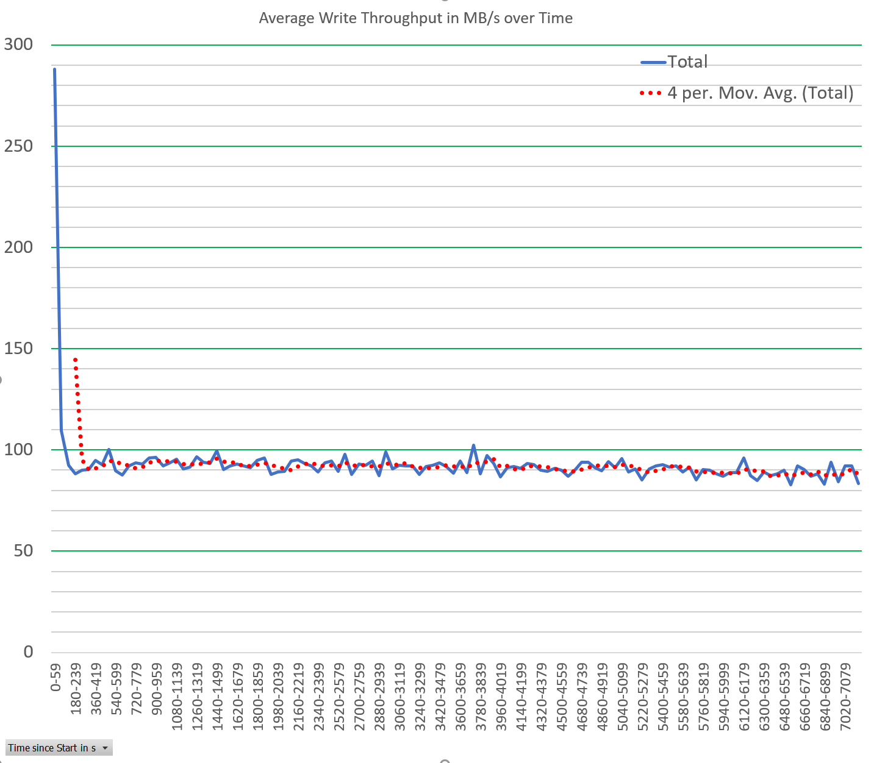

# FileStress

FileStress is a performance measurement and stress test tool to measure how the file system, hard disk, and memory management behaves.

Its primary use case is to qualify SSD drives if they can keep their sustained write rate over many minutes or even hours. A very insightful article about SSD performance is 

 - https://www.seagate.com/de/de/tech-insights/lies-damn-lies-and-ssd-benchmark-master-ti/

After reading that article you know that the offical numbers reported by industry leading benchmarks such as CrystalDiskMark do not show the full picture.
For home use cases these benchmark numbers are ok but if you need e.g. to store high volume sensor data you will learn the hard way that the vendor reported numbers 
can be much lower.
FileStress was created to fill the gap to measure not only best case but also sustained write performance of SSDs or any drive. 

Usage:

Write 10 MB sized files from (default) two threads on the D drive for 2 hours (120 minutes)

```
C:>FileStress.exe -throughput 120 D:

Drive D:\ has 393 GB free. 
Sleep for 6000ms
Execute test on 2 threads
...
Open:   0 ms, Close:   2 ms, Write:  37 ms, Last 10s 675  MB/s
Open:   0 ms, Close:   1 ms, Write:  37 ms, Last 10s 675  MB/s
Open:   0 ms, Close:   2 ms, Write:  36 ms, Last 10s 675  MB/s
Open:   0 ms, Close:   2 ms, Write:  22 ms, Last 10s 675  MB/s
Open:   0 ms, Close:   2 ms, Write:  44 ms, Last 10s 675  MB/s
Details can be found in file c:\Througput_MyHomeMachine_10MB_120minutes_17_31_07.csv
Cleaning 1067 temp files from c:\TempFilePerformanceTest
```

The resulting CSV File can be used to plot Average throughput over time to check if the drive has some issues with keeping a specific data rate for a longer time.
Below is a consumer SSD which has according to CrystalDiskMark this performance


If we look at the FileStress generated CSV data which was writing for 2 hours we arrive at 90 MB/s sustained write performance which is far off the 480 MB/s reported by CrystalDiskMark.
Although we did repeat the test 9 times with a 64 GiB file CrystalDiskmark shows not the sustained write rate!
FileStress data shows that the sustained write performance degrades after around 3 minutes which is not much.




